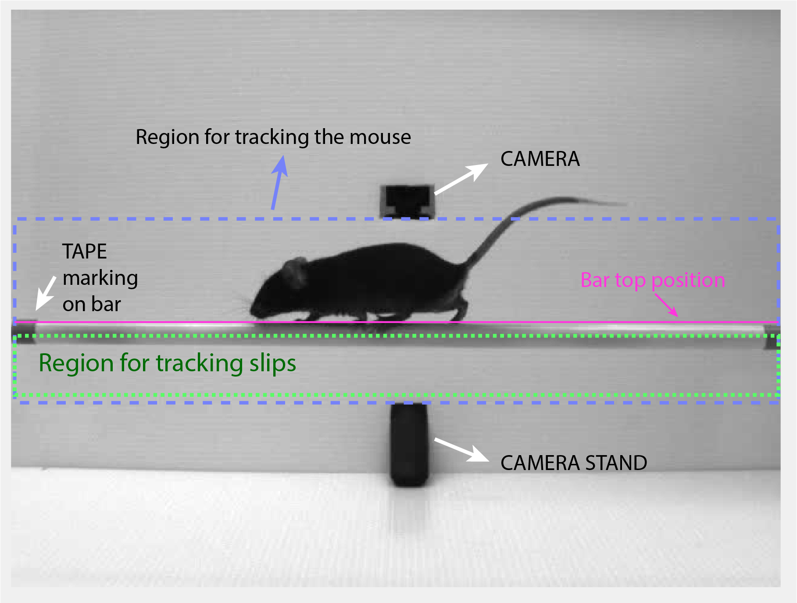
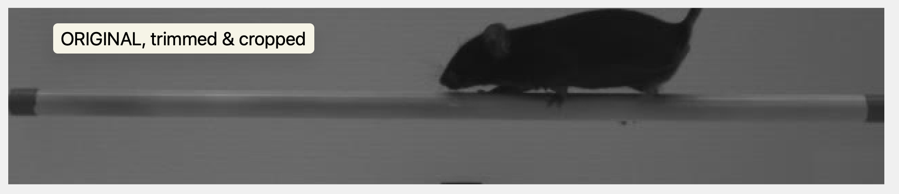
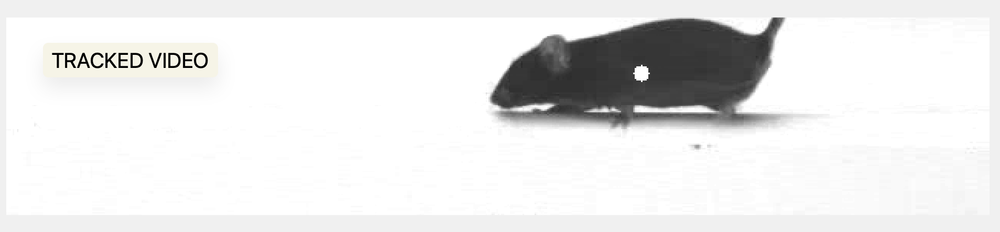
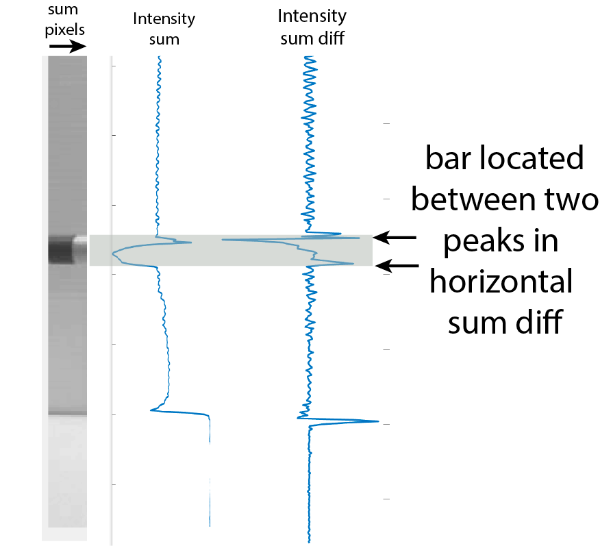
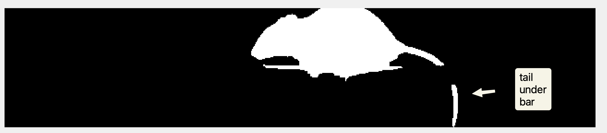
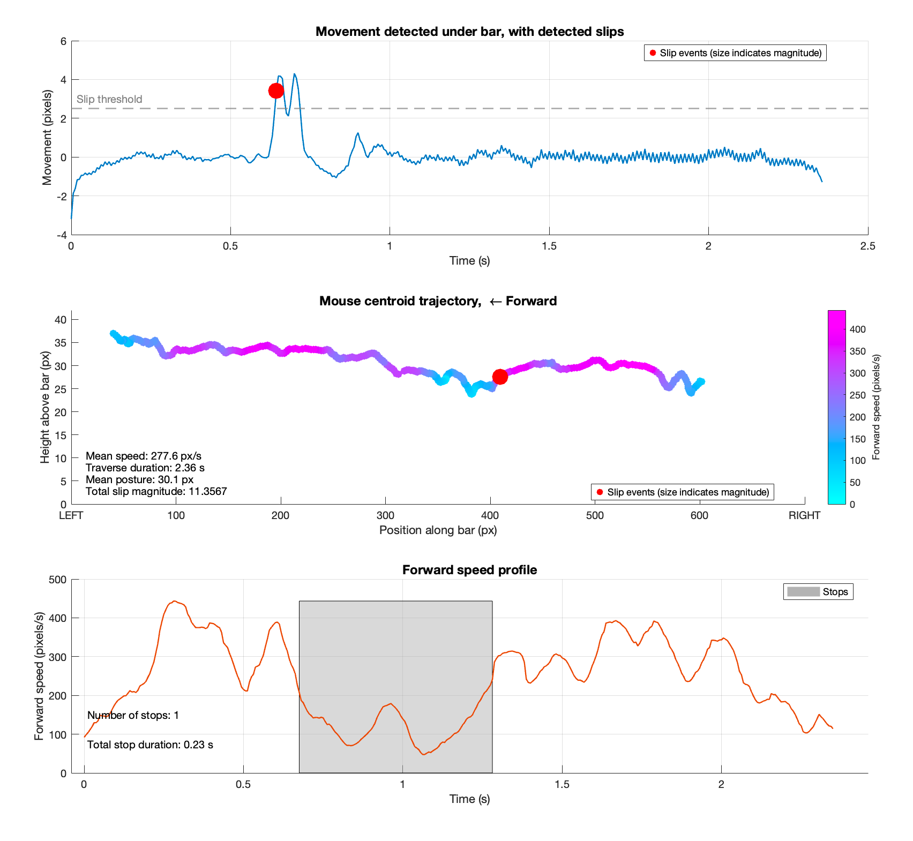

# BeamCross: A MATLAB Tool for Balance Beam Video Analysis

This repository contains a set of **MATLAB** functions and scripts for analyzing mouse locomotion and slip events on a balance beam. The core workflow includes detecting camera edges, locating the bar, tracking the mouse, computing weighted movement metrics, and identifying slip events.

## Table of Contents
- [BeamCross: A MATLAB Tool for Balance Beam Video Analysis]
  - [Background - why not use deep learning?](#background---why-not-use-deep-learning)
  - [Formal description of the algorithm](#formal-description-of-the-algorithm)
    - [Formal Definition of Slip Events and Magnitudes](#formal-definition-of-slip-events-and-magnitudes)
  - [Description of functions](#description-of-functions)
    - [**`BBanalysisSingleFile.m`**](#bbanalysissinglefilem)
    - [**`trackMouseOnBeam.m`**](#trackmouseonbeamm)
    - [**`detectBar.m`**](#detectbarm)
    - [**`detectSlips.m`**](#detectslipsm)
    - [**`plotBBtrial.m`**](#plotbbtrialm)
  - [Additional Helpers and Subfolders](#additional-helpers-and-subfolders)
  - [Basic Workflow](#basic-workflow)
  - [Dependencies](#dependencies)


## Background - why not use deep learning?

Assessing mouse performance on a balance beam is one of the gold classics of systems neurobiology, as balance perturbations are a common symptom of numerous malfunctions of the central nervous system as well as the periferal sensory mechanisms. Experiments where a mouse is tasked by traversal of a narrow beam have been conducted for decades, and the assessment has been, until recently, based entirely on manual scoring - i.e. by a researcher observing either the animals or recorded videos and counting the number of slipping occurrences. 


## Formal description of the algorithm

After loading and preprocessing the video, detecting the bar, and tracking the mouse, we compute a weighted movement metric to quantify mouse-related movement. This metric is used to identify slip events based on a user-defined threshold. The algorithm consists of the following steps:

We quantify mouse-related movement from video data using a weighted, pixel-level difference metric.
Given a binary mouse-mask matrix $M \in \{0,1\}^{H \times W \times N}$, where $M_{h,w,n}=1$ indicates that pixel $(h,w)$ belongs to the mouse in frame $n$, and an under-bar grayscale video matrix $V \in [0,1]^{H\times W\times N}$, we first calculate the fraction of mouse pixels per column as:

$$
C_{w,n} = \frac{1}{H}\sum_{h=1}^{H} M_{h,w,n}, \quad w=1,\dots,W,\quad n=1,\dots,N
$$

Next, we compute the absolute frame-to-frame difference in pixel intensity (with $D_{h,w,1}=0$):

$$
D_{h,w,n} = |V_{h,w,n} - V_{h,w,n-1}|,\quad n=2,\dots,N
$$

Summing vertically along columns, we obtain a column-wise measure of pixel intensity change:

$$
S_{w,n} = \sum_{h=1}^{H} D_{h,w,n}, \quad n=2,\dots,N
$$

Finally, these differences are weighted by the squared mouse fractions to emphasize areas with high mouse occupancy, yielding our weighted movement measure per frame:

$$
W_n = \sum_{w=1}^{W} S_{w,n}\,(C_{w,n})^2,\quad n=2,\dots,N
$$

This weighted metric $W_n$ robustly captures mouse-specific movement, which can be further normalized or smoothed as needed, and is used to identify slip events based on a user-defined threshold.

To detect slip events, we apply a threshold $\tau$ to obtain a binary slip mask $B_n$:

$$
B_n = 
\begin{cases}
  1, & W_n \geq \tau \\
  0, & W_n < \tau
\end{cases}
,\quad n=2,\dots,N
$$

We refine this slip mask with morphological operations to ensure robust event detection:

* **Morphological Closing**:
  Small gaps (up to 2 frames wide) are closed to merge temporally close slip detections. Given a linear structuring element $E$ of length 3, morphological closing (dilation followed by erosion) is defined as:

$$
  B_n^{\text{closed}} = (B_n \oplus E) \ominus E
$$

  where $\oplus$ and $\ominus$ represent dilation and erosion, respectively.

* **Removal of Brief Slip Events**:
  We discard slip events shorter than 3 frames, ensuring each detected slip event $S_j$ (a contiguous set of slip frames) satisfies:

$$
  |S_j| \geq 3 \text{ frames}
$$

Lastly, we identify contiguous slipping periods as connected components in $B_n^{\text{closed}}$. Each contiguous set of slip frames defines a distinct slip event for further analysis.

### Formal Definition of Slip Events and Magnitudes

Given the previously defined binary slip mask $B_n^{\text{closed}}$, we identify contiguous slip events as connected components within it. Each contiguous slip event $S_j$ (where $j = 1,\dots,n_{\text{slips}}$) is defined by a set of frame indices:

$$
S_j = \{ n \mid B_n^{\text{closed}} = 1 \text{ and } n_{\text{start}, j} \leq n \leq n_{\text{end}, j} \}
$$

where $n_{\text{start}, j}$ and $n_{\text{end}, j}$ are the first and last frames of the $j$-th slip event, respectively.

For each slip event, the **slip magnitude** ($A_j$) is computed as the area under the weighted movement trace $W_n$, above the slip threshold $\tau$:

$$
A_j = \sum_{n \in S_j}(W_n - \tau), \quad j = 1,\dots,n_{\text{slips}}
$$

The **peak slip magnitude** ($P_j$) is defined as the maximum weighted movement during the slip event:

$$
P_j = \max_{n \in S_j}(W_n), \quad j = 1,\dots,n_{\text{slips}}
$$

Finally, the **slip duration** ($D_j$) for the $j$-th slip is simply the number of frames within the slip event:

$$
D_j = n_{\text{end}, j} - n_{\text{start}, j} + 1, \quad j = 1,\dots,n_{\text{slips}}
$$

The total number of detected slips in a trial is then given by $n_{\text{slips}}$.


The algorithm is implemented in the `detectSlips.m` function, which processes the video data and mouse mask to identify slip events based on the computed weighted movement trace. See details in the documentation below.

## Description of functions

The camera view of a balance beam setup typically includes a horizontal bar and a mouse traversing the beam. The bar and camera edges are detected to establish a region of interest (ROI) for tracking the mouse. The mouse’s centroid is tracked across frames, and a weighted movement metric is computed to emphasize the mouse’s presence. Slip events are detected based on this metric, and their severity is quantified.


### `BBanalysisSingleFile.m` 
   The main entry point for analyzing a single `.mp4` video file. Loads and preprocesses the video, detects the bar, tracks the mouse, computes slips, and optionally produces plots and annotated videos. Returns all relevant measurements in a structured output.

### **`trackMouseOnBeam.m`**  
Tracks the mouse position on the beam across frames. Returns mouse centroids, speed information, stops, and three versions of the video: binary mask, a background-subtracted video with the centroid of the mouse indicated, and the original video cropped and trimmed to match the tracked ones.

```matlab
[mouseCentroids, instForwardSpeed, meanSpeed, traverseDuration, stoppingPeriods,...
 meanSpeedLoco, stdSpeedLoco, mouseMaskMatrix, trackedVideo, croppedVideo] = ...
 trackMouseOnBeam(croppedVideo, MOUSESIZETH, LOCOTHRESHOLD, USEMORPHOCLEAN, ...
 mouseContrastThreshold, FRAMERATE)
```

   _Notes_:
   - The mouse is presumed to be black (or much darker than anything else in the image). 
   - MOUSESIZETH defines the minimal area (in percentage of the cropped image) that need to be black to be considered mouse. Current default is 5%. Note that since the mouse walks into the frame at the beginning, the tracking only starts when there's "enough" of a mouse in the frame. You can decrease this to get more frames at the beginning (and end), but best not to go too low or you can get noise.
   - LOCOTHRESHOLD indicates the threshold horizontal speed (in px/sec) below which we consider the mouse has stopped. 
   - USEMORPHOCLEAN: set to "true" if the image is noisy and you want the mouse border to look smoother. However should not be necessary for tracking as it is a costly operation.
   - mouseContrastThreshold: used to binarize the mouse. Current default is 0.6 (should be between 0 and 1). If the mouse is not dark enough, make this value higher. 
   - Experimenter's hand is not usually a problem as long as it stays away from the mouse tracking area (indicated in the diagram above).
   - The resulting data and videos are given only for the (longest) period in the trial in which a mouse is deemed present.


   
   
   

### **`detectBar.m`**  
   Locates the horizontal bar by analyzing the edges of the mean image. Pixels in the region where the tapes are are summed horizontally, and points of fast darkening and brightening are taken as the bar edges (i.e. peaks in the differential of the sum). Returns the bar’s top coordinate and thickness in pixels.

```matlab
[barTopYCoord, barWidth] = detectBar(barImage, mouseStartPosition, varargin)
```
   _Notes on input arguments_:
   - barImage: the mean image of the cropped video (or a single frame) where the bar is visible
   - mouseStartPosition: the side of the bar where the mouse starts (L or R). This is used to determine which side of the bar to look at for the edge detection.
   - 'MAKEDEBUGPLOT' - Enable debugging plots (default: false).
%  - 'barTapeWidth' - Percentage of image width for bar tape width (default:2%).

    
   Points to note: 
   - To avoid getting confused by cases where the recording starts too late and mouse is already on the bar in first frames, we look at the side opposite to mouse starting position. The starting position is currently expected to be L for CAM1 and R for CAM2.
   - However, as the bar is never completely straight, the value will not be exactly correct (maybe 5 - 8 pixels difference between left and right sides). If we could be sure that there are some frames without a mouse, we could take both sides and average (or project a straight line between them).
   - This means also that the posture of the mouse most likely will be seen to shift gradually from one to another edge, as it's calculated relative to bar position.
   - Note that the top-level function `BBanalysisSingleFile` can also receive bar position and thickness as input arguments, in which case it will not be recalculated. This helps if the bar in your images is not easily detectable (e.g. there are no black tapes on) or you want to speed up the code by skipping the bar detection step.
  

### **`detectSlips.m`**  
   Generates the weighted movement trace to find slip intervals (above a threshold). The slips are only counted if they happen "under the mouse". Returns the start frames, duration, peak values, and area (severity) of each slip event.

```matlab
[slipEventStarts, slipEventPeaks, slipEventAreas, slipEventDurations, movementTrace, ...
underBarCroppedVideo] = detectSlips(trackedVideo, mouseMaskMatrix, barTopCoord, ...
 barThickness, SLIPTHRESHOLD, UNDERBARSCALE, DETRENDWINDOW)
 ```

   _Notes on input arguments_:
   - tracked video: grayscale, background-removed, mouse-enhanced video cropped and trimmed to the same dimensions as the binarized video
   - mouseMaskMatrix: the binarized mouse mask video
   - bardTopCoord: the y-coordinate of the top edge of the bar, as obtained by detectBar-function; used to define the "above-bar" region note that the coordinate matches bar position in the cropped (rather than original) video
   - barThickness: thickness of bar in pixels, used to define the "below-bar" region for detecting slipping
   - SLIPTHRESHOLD: a threshold value (a.u.) describing how large a below-bar movement should be to be considered a slip. If you worry about false slips detected with normal paw motion, increase this value. Current default: 2.
   -UNDERBARSCALE (optional): how much below the bar we look for movement (multiplies of bar width). Current default: 2
   -DETRENDWINDOW (optional): temporal window for detrending the movement trace to sharpen slip detection. Currend default 64 frames (0.4s)

   Principle is simple: look at how much between-frames changes happen below the bar:
```matlab
   totalMovement = sum(abs(currentFrame - previousFrame)); 
```
However, sometimes the tail of the mouse swings below the bar and might be detcted as a slip:
 

 To avoid this, we want to only consider movement below the bar in positions that are under the mouse. As the mouse is not a rectangle, calculate "mouse probability distribution" above the bar using local functions:
 -  **`LF_computeMouseProbabilityMap.m`**  
   Computes a per-column “probability” or fraction of the mouse mask occupying that column above the bar. Helps weight movement by how fully the trunk is present vs. just the tail. 
   -  **`LF_computeWeightedMovement.m`**  
   Given a video region of interest (e.g., under the bar) and the column probabilities, calculates a movement trace that weighs each column’s differences by how likely the mouse is there.

   Combining the results of these two local functions, we can get a weighted movement trace that is robust to noise and tail movements. Slips are detected by thresholding this trace, and the results are returned in the following output variables: 
   - slipEventStarts: the frame numbers where slips start
   - slipEventPeaks: the peak values of the weighted movement trace during slips
   - slipEventAreas: the area under the weighted movement trace during slips
   - slipEventDurations: the duration of each slip event in frames
   - movementTrace: the full weighted movement trace for the entire video
   - underBarCroppedVideo: the cropped video of the region below the bar, used for visualization

### **`plotBBtrial.m`**  
   Creates diagnostic plots: a movement trace vs. time (with slip markers) and a 2D mouse centroid trajectory, color-coded by speed. Also places arrow annotations and summary text on the figure.
```matlab
plotBBtrial( movementTrace, FRAMERATE, slipEventStarts, slipEventAreas, ...
    mouseCentroids, forwardSpeeds,meanSpeed, meanPosturalHeight,trialName, LOCOTHRESHOLD, SLIPTHRESHOLD)
```
   _Notes on input arguments_:
   - movementTrace: the full weighted movement trace for the entire video
   - FRAMERATE: the frame rate of the video
   - slipEventStarts: the frame numbers where slips start
   - slipEventAreas: the area under the weighted movement trace during slips
   - mouseCentroids: the x and y coordinates of the mouse centroid in each frame
   - forwardSpeeds: the forward speed of the mouse in each frame
   - meanSpeed: the mean speed of the mouse in each frame
   - meanPosturalHeight: the mean height of the mouse above the bar in each frame
   - trialName: the name of the trial (used for plot titles)
   - LOCOTHRESHOLD: the threshold for determining if the mouse is moving or stopped (in px/sec, default:100)
   - SLIPTHRESHOLD: the threshold for determining if a slip has occurred (in a.u., default:2.5)
   
   The function generates a figure with the following panels:
      

## Additional Helpers and Subfolders

Some functions and scripts reside in separate subfolders for organization:

- **`visualization/`** may contain GUIs or interactive display tools like **`displayBehaviorVideoMatrix`** (a function that plays back frames, provides a slider and “play/pause” button, etc.).
- **`videoProcessing/`, `videoImageAnalysis/`, `helperFunctions/`** may hold smaller utility scripts (`readVideoIntoMatrix.m`, `getMeanFrame.m`, etc.) that perform image I/O, frame differencing, or morphological operations needed by the main pipeline.

## Basic Workflow

1. **Run** `BBanalysisSingleFile.m`, pointing it to a `.mp4` file and specifying optional parameters:
   ```matlab
   R = BBanalysisSingleFile('path/to/data', 'mouse_trialA.mp4', ...
       'MAKEPLOT', true, 'SLIPTHRESHOLD', 2.5);

2. **Inspect results** in R, which includes
  - mouseCentroids, forwardSpeeds, meanSpeed, traverseDuration - info on the general traversing
  - slipEventStarts, slipEventDurations, slipEventAreas, etc. - info on detected slips
  - slipFrames, slipFrameDurations - the frames where slips occurred
  - slipPeakValues - the peak movement values during slips
3. **Visualize** the results with `plotBBtrial.m`:
   ```matlab
   plotBBtrial(R, 'mouse_trialA.mp4');
   ```
    This will show a movement trace, a 2D trajectory, and annotated slip events.
4. **Inspect** the annotated video (if requested) or other diagnostic plots to verify the analysis.

## Dependencies
- MATLAB (tested on R2024b).
- Image Processing Toolbox (for insertShape, morphological ops, etc.).
- Videos in .mp4 format, requires ffmpeg installation and presence on path.    
  
