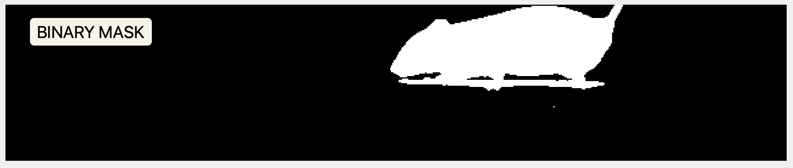

# BeamCross: A MATLAB Tool for Balance Beam Video Analysis

This repository contains a set of **MATLAB** functions and scripts for analyzing mouse locomotion and slip events on a balance beam. The core workflow includes detecting camera edges, locating the bar, tracking the mouse, computing weighted movement metrics, and identifying slip events.

## Background - why not use deep learning?

Assessing mouse performance on a balance beam is one of the gold classics of systems neurobiology, as balance perturbations are a common symptom of numerous malfunctions of the central nervous system as well as the periferal sensory mechanisms. Experiments where a mouse is tasked by traversal of a narrow beam have been conducted for decades, and the assessment has been, until recently, based entirely on manual scoring - i.e. by a researcher observing either the animals or recorded videos and counting the number of slipping occurrences. 

## Overview of the code

The camera view of a balance beam setup typically includes a horizontal bar and a mouse traversing the beam. The bar and camera edges are detected to establish a region of interest (ROI) for tracking the mouse. The mouse’s centroid is tracked across frames, and a weighted movement metric is computed to emphasize the mouse’s presence. Slip events are detected based on this metric, and their severity is quantified.


1. **`BBanalysisSingleFile.m`**  
   The main entry point for analyzing a single `.mp4` video file. Loads and preprocesses the video, detects the bar, tracks the mouse, computes slips, and optionally produces plots and annotated videos. Returns all relevant measurements in a structured output.

2. **`trackMouseOnBeam.m`**  


   Tracks the mouse position on the beam across frames. Returns mouse centroids, speed information, stops, and three versions of the video: binary mask, a background-subtracted video with the centroid of the mouse indicated, and the original video cropped and trimmed to match the tracked ones.

      ```matlab
   [mouseCentroids, instForwardSpeed, meanSpeed, traverseDuration, stoppingPeriods,meanSpeedLoco, stdSpeedLoco, mouseMaskMatrix, trackedVideo, croppedVideo] = trackMouseOnBeam(croppedVideo, MOUSESIZETH, LOCOTHRESHOLD, FRAMERATE)
   ```
   _Notes_:
   - The mouse is presumed to be black (or much darker than anything else in the image). 
   - MOUSESIZETH defines the minimal area (in percentage of the cropped image) that need to be black to be considered mouse. Current default is 5%. Note that since the mouse walks into the frame at the beginning, the tracking only starts when there's "enough" of a mouse in the frame. You can decrease this to get more frames at the beginning (and end), but best not to go too low or you can get noise.
   - LOCOTHRESHOLD indicates the threshold horizontal speed (in px/sec) below which we consider the mouse has stopped. 
   - Experimenter's hand is not usually a problem as long as it stays away from the mouse tracking area (indicated in the diagram above).
   - The resulting data and videos are given only for the (longest) period in the trial in which a mouse is deemed present.


   
   
   

1. **`detectBar.m`**  
   Locates the horizontal bar by analyzing the edges of the mean image. Pixels in the region where the tapes are are summed horizontally, and points of fast darkening and brightening are taken as the bar edges (i.e. peaks in the differential of the sum). Returns the bar’s top coordinate and thickness. 
   Points to note: 
   - To avoid getting confused by cases where the recording starts too late and mouse is already on the bar in first frames, we look at the side opposite to mouse starting position. The starting position is currently expected to be L for CAM1 and R for CAM2.
   - However, as the bar is never completely straight, the value will not be exactly correct (maybe 5 - 8 pixels difference between left and right sides). If we could be sure that there are some frames without a mouse, we could take both sides and average (or project a straight line between them).
   - This means also that the posture of the mouse most likely will be seen to shift gradually from one to another edge, as it's calculated relative to bar position.
  

1. **`detectSlips.m`**  
   Generates the weighted movement trace to find slip intervals (above a certain threshold). Returns the start frames, duration, peak values, and area (severity) of each slip event.
   Makes use of these procedures;
   -  **`computeMouseProbabilityMap.m`**  
   Computes a per-column “probability” or fraction of the mouse occupying that column. Helps weight movement by how fully the trunk is present vs. just the tail.
   -  **`computeWeightedMovement.m`**  
   Given a video region of interest (e.g., under the bar) and the column probabilities, calculates a movement trace that weighs each column’s differences by how likely the mouse is there.

2. **`plotBBtrial.m`**  
   Creates diagnostic plots: a movement trace vs. time (with slip markers) and a 2D mouse centroid trajectory, color-coded by speed. Also places arrow annotations and summary text on the figure.

## Additional Helpers and Subfolders

Some functions and scripts reside in separate subfolders for organization:

- **`visualization/`** may contain GUIs or interactive display tools like **`displayBehaviorVideoMatrix`** (a function that plays back frames, provides a slider and “play/pause” button, etc.).
- **`videoProcessing/`, `videoImageAnalysis/`, `helperFunctions/`** may hold smaller utility scripts (`readVideoIntoMatrix.m`, `getMeanFrame.m`, etc.) that perform image I/O, frame differencing, or morphological operations needed by the main pipeline.

## Basic Workflow

1. **Run** `BBanalysisSingleFile.m`, pointing it to a `.mp4` file and specifying optional parameters:
   ```matlab
   R = BBanalysisSingleFile('path/to/data', 'mouse_trialA.mp4', ...
       'MAKEPLOT', true, 'SLIPTHRESHOLD', 2.5);

2. **Inspect results** in R, which includes
  - mouseCentroids, forwardSpeeds, meanSpeed, traverseDuration - info on the general traversing
  - slipEventStarts, slipEventDurations, slipEventAreas, etc. - info on detected slips
  - slipFrames, slipFrameDurations - the frames where slips occurred
  - slipPeakValues - the peak movement values during slips
3. **Visualize** the results with `plotBBtrial.m`:
   ```matlab
   plotBBtrial(R, 'mouse_trialA.mp4');
   ```
    This will show a movement trace, a 2D trajectory, and annotated slip events.
4. **Inspect** the annotated video (if requested) or other diagnostic plots to verify the analysis.

## Dependencies
- MATLAB (tested on R2024b).
- Image Processing Toolbox (for insertShape, morphological ops, etc.).
- Videos in .mp4 format, requires ffmpeg installation and presence on path.    
  
