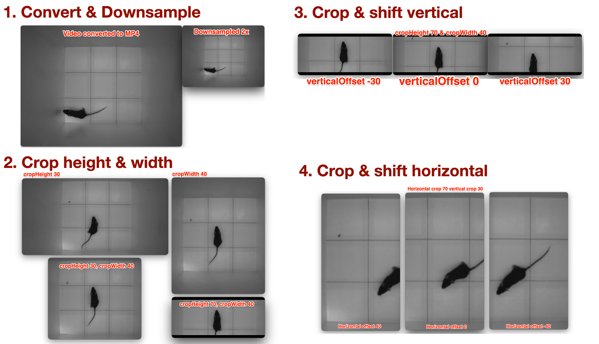
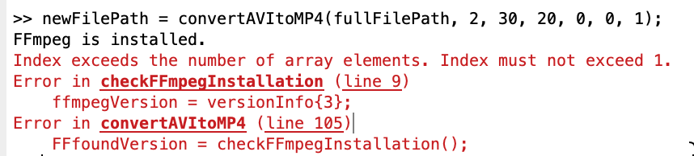

# mousePerformanceAnalysis

This repository contains MATLAB scripts for analyzing mouse performance in various motor tasks. 

Currently we have 3 behavioral tasks:

1. **Beam Crossing**
2. **Open Field**
3. **Rightning Reflex**

All processing is based on video recordings. As a first step, the raw video files are processed using FFmpeg to convert them to a more manageable format (MP4) and resolution, possibly cropping as applicable to decrease file size. 

# table of contents
1. [Beam Crossing](#beam-crossing)
2. [Open Field](#open-field)
3. [Rightning Reflex](#rightning-reflex)
4. [Video Processing Scripts](#video-processing-scripts)
5. [Getting Started](#getting-started)
6. 

## Beam Crossing

## Open Field

## Rightning Reflex

# Video Processing Scripts

This folder contains MATLAB scripts for video file handling.

##  convertAVIToMP4 
Function to convert an AVI file to MP4 format using FFmpeg. Additionally allows downsampling, cropping and shifting of the video.
Note that the function calls FFmpeg, so it is necessary to have FFmpeg installed on your system and added to your system path.

### Example uses
```matlab
currNamePath = convertAVItoMP4(fullFilePath, DOWNSAMPLERATIO, cropVideoVertical, cropVideoHorizontal, verticalOffset, horizontalOffset, OVERWRITEEXISTING);

% Convert an AVI file to MP4 format without downsampling; if the output file already exists, we add '_new' to the filename
currNamePath = convertAVItoMP4('C:\Users\username\Documents\video.avi'));

% Convert an AVI file to MP4 format with 2x downsampling, overwrite existing file if it exists
currNamePath = convertAVItoMP4('C:\Users\username\Documents\video.avi', 2, 0, 0, 0, 0, 1);

% Convert an AVI file to MP4 format with 2x downsampling, crop 10% from the top and bottom, and 5% from the left and right, overwrite existing file if it exists
currNamePath = convertAVItoMP4('C:\Users\username\Documents\video.avi', 2, 10, 10, 0, 0, 1);

% Convert to MP4 with 2x downsampling, crop 10% from the top and bottom, and 5% from the left and right, and shift the video 20% to the right and 15% up, overwrite existing file if it exists
currNamePath = convertAVItoMP4('C:\Users\username\Documents\video.avi', 2, 10, 10, 20, 15, 1);
```



### Troubleshooting
The conversion is done with FFmpeg, and it has been tested with versions 6.1.1 at least. If you encounter strange behavior, check if the version matches.

Also if you encounter an error like this:

it might be caused by system command not completing correctly. Try to run the function again.


## Getting Started

### Dependencies

* MATLAB
* FFmpeg

### Installing

* Clone this repository to your local machine.
* Ensure you have MATLAB and FFmpeg installed on your system.

### Executing program

* Open the script in MATLAB.
* Modify the variables at the top of the script to specify your input file, output file, cropping percentages, and downsampling ratio.
* Run the script.

## Help

If you encounter any problems or have any questions, please open an issue in this repository.

## Authors

[Your Name]
[Your Contact Information]

## Version History

* 0.1
    * Initial Release

## License

This project is licensed under the [NAME HERE] License - see the LICENSE.md file for details

## Acknowledgments

* [Name of the person to thank]
* [If applicable, any other party to acknowledge]